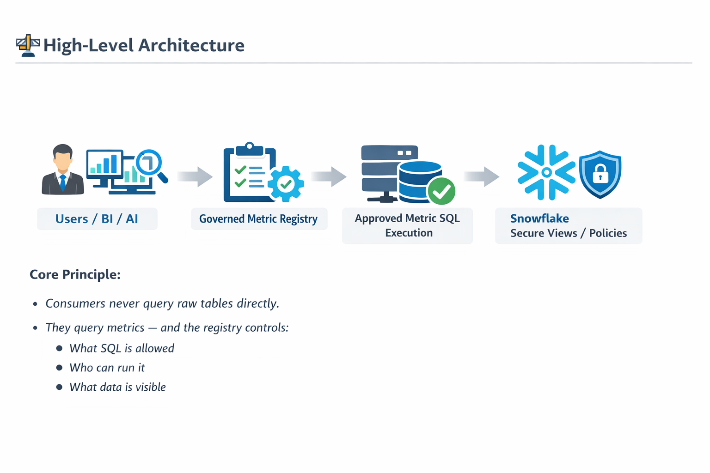

# 🧭 Governed Metric Registry  
**Trusted metrics for humans and AI — governed at the source**

---

## 📌 Overview  

**Governed Metric Registry** is a **Snowflake-native platform** for defining, approving, governing, and consuming enterprise business metrics.

Unlike traditional semantic layers that focus on query abstraction for BI tools, this project focuses on **metric trust and decision governance**:

- ✅ Metrics are defined once  
- ✅ Explicitly approved by the business  
- ✅ Executed centrally in Snowflake  
- ✅ Safely consumed by BI tools, Streamlit apps, and AI agents  
- ✅ Enforced with role-aware access controls  

The registry ensures that **humans and AI always compute metrics consistently**, without exposing raw data or embedding logic in dashboards.

---

## ⚖️ What This Is (and Is Not)

### ✅ What this project *is*

- Central registry of **approved business metrics**
- Governance layer for **KPI definitions and ownership**
- Execution control plane for **metrics in Snowflake**
- AI-safe interface for **natural-language metric queries**
- Single source of truth for **enterprise KPIs**

---

### ❌ What this project *is not*

- Not a BI semantic layer replacement  
- Not a dimension / join modeling framework  
- Not dashboard-specific  
- Not free-form SQL over raw tables  

> 💡 **Semantic layers optimize query usability.**  
> 💡 **Governed metric registries optimize decision trust.**

---

## 🚀 Key Capabilities  

### 🧩 Governed Metric Definitions  

- Central **table-driven registry** of metric SQL  
- Business ownership and approval metadata  
- Domain, grain, and description per metric  
- Version-ready design *(future-proof)*  

---

### 🔐 Role-Aware Enforcement  

- Metrics execute only if the caller’s **Snowflake role is authorized**  
- Built on:
  - Snowflake RBAC  
  - Row Access Policies  
  - Masking Policies  
- No hardcoded filters or application-level logic  

---

### 🤖 AI-Assisted Metric Access  

- Natural language → SQL translation  
- AI can execute **only approved metrics**  
- Built-in refusal behavior when:
  - Metric is not registered  
  - Role is not authorized  
  - Query attempts raw data access  

---

### 🖥️ Streamlit Governance UI  

- Register metrics  
- Approve or disable metrics  
- Assign metric ownership  

> No direct SQL editing required by business users.

---

### 📊 Auditability & Compliance  

- Clear ownership per metric  
- Centralized execution path  
- Compatible with:
  - Snowflake Access History  
  - Query Logs  

---

## 🏗️ High-Level Architecture  

**Core Principle:**

> Consumers never query raw tables directly.  
> They query metrics — and the registry controls:
> - What SQL is allowed  
> - Who can run it  
> - What data is visible  

---

## 🤖 AI Governance Model  

**AI Access Rules:**

- ✅ AI can only reference registered metrics  
- ❌ AI cannot invent SQL  
- ❌ AI cannot query raw tables  
- ✅ AI must respect Snowflake role permissions  

---

## ⚡ Getting Started (High Level)

1. Deploy registry tables and procedures in Snowflake  
2. Apply security policies  
3. Launch Streamlit governance UI  
4. Register and approve initial metrics  
5. Connect BI tools or AI agents  

---

## 📜 License  

This project is licensed under the **Apache License 2.0**.  
See the `LICENSE` file for details.

---

## 💡 Why This Matters  

> Inconsistent metrics break trust.  
> Uncontrolled AI amplifies inconsistency.

**Governed Metric Registry ensures:**

- ✅ One definition per KPI  
- ✅ Business ownership  
- ✅ AI with guardrails  
- ✅ Snowflake-native enforcement  

---
## ✍️ Learn More & Support

If you find this project valuable, you can:

- 📖 Follow my writing on Medium  
- ☕ Support my work  
- 💎 Get premium resources  

  

